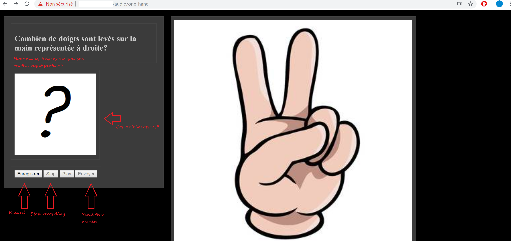
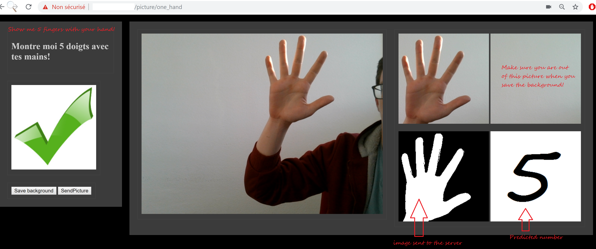

# Finger recognition

# Context

To write

# Use the application

## Launch

Once you're done with the configuration, just run the following command;

<code>gunicorn --certfile=./keys/comptage.crt --keyfile=./keys/comptage.key app.wsgi:application </code>

Without gunicorn, you can test your web application in the manage.py folder with:

<code>python3 manage.py runsslserver</code>

Then go to the following address:

https://your_ip_or_server_name:443

You will see the home webpage.

### Audio

### Draw

### Picture

# Configuration

How to configurate your system before launching the application?

## General configuration

It worked on ubuntu 16.04 LTS and a virtual environment set up with python 3.6.8.

Currently (november 2019), the opencv-contrib-python module has some compatibility issues with python 3.7, that's why I did not use the last version of python for this project.

To reproduce this environment, just use the requirements.txt file in the doc/install folder.

## Webserver

### Architecture

A picture is worth a thousand words.

### Django

If you want to understand the role of each file, see ref 5 and the django_channels documentation : https://channels.readthedocs.io/en/latest/

A quick summary :
- asgi.py and wsgi.py gathers informations about the gate server interface (asgi for dpahne, wsgi for gunicorn and local django servers)
- routing.py routes the websocket to the right consumers
- urls.py defines how your will navigate through the webpages and link one specific view to one url
- models.py defines your database model, i.e. what type of data you want to store
- consumers.py defines how you receive and send data through websockets. It's called by Daphne.
- views.py defines what content your webpage will print
- settings.py defines the settings you use in your project. To use the code in production, just change debug to False
- the templates folder contains your html pages
- the static folder contains all your static files called by your html code. Each type of file (img for images, js for javascript and css) has its own sub-folder.

Each sub-folder corresponds to a specific url. Picture's views or consumers are called when the client do a request beginning with /picture.

### Nginx

If you don't know nginx, see the third reference.

Just use the file conf/nginx.conf as your nginx configuration file (the default location should be /etc/nginx/nginx.conf).

Nginx will :
- load the static files (you'll have to change the static files' location by yours),
- redirect the /ws/* requests (TCP) to Daphne,
- redirect the other requests (https) to gunicorn/django,
- secure the http protocol, allowing us to get a video from the webcam and voice's sound from the microphone.

Your can check your nginx configuration file by typing:

<code>sudo nginx -t</code>

If it fails, see ref 2, and check the logs:

<code>sudo journalctl -xe</code>

Launch nginx with the following command line:

<code>sudo systemctl start nginx</code>

#### Daphne

Daphne will handle the link between django and the websocket.

Depending on the type of websocket used or the data sent by the client, it will use different machine learning models to predict a number (either a spoken/written number, or a number of fingers).

If you keep the daphne.service file as it is in the conf file, Daphne will listen at 0.0.0.0:8001.

Define daphne as a service (see ref 2.) and launch it via the command line:

<code>sudo systemctl start daphne</code>

You should be able to see if it works by typing the following command:

<code>sudo systemctl status daphne</code>

For some reason, if the websocket crashes during the computation, just launch the following command to restart daphne:

<code>sudo systemctl restart daphne</code>

If the service is active, you'll see a green active(running) in the console.

### About the keys folder

I let one pair of ssl certificate-key in the keys folder, so you can run the project.

But it's self-signed, and chrome or firefox will print a warning if you don't change them.

## Models

This part describes how the data analysis is implemented.

See all the consumers.py files to see how the web app uses these models.

### Speech recognition model

TODO: Develop some fancy model, to classify your speech into seven categories; (0, 1, 2, 3, 4, 5, nothing said or not a number). Or just train a new dictionary on a reduced vocabulary withi numbers.

Input: A spoken number in a sound file (.wav format)

Output: The prediction of the last number you said

I did not train anything for this model, I just used sphinx, a speech recognition software.

Working with google speech recognition tools gives better results, but you have a limited number of requests you can send in a day (50 requests of 1 minute max), so your software will break at some point.

Unlike the others models, you will have to install other linux packages to get this model working.

To use the speech_recognition model with pocketsphinx, just follow https://doc.ubuntu-fr.org/pocketsphinx 

If you want the audio model to work on other languages than english (US):
- Download your dictionary (either go to models/audio to get the french dictionary, or https://sourceforge.net/projects/cmusphinx/files/Acoustic%20and%20Language%20Models/) or build one https://cmusphinx.github.io/wiki/tutorialdict/

- Just put the folder in the pocketsphinx-data library folder : your_python_environment_name/python3.x/lib/site-packages/speech_recognition/pocketsphinx-data

You should have the 'en-US' installed there by default

- Modify app/audio/consumers.py ; the number array should be the numbers (string format) from zero to ten (both included) in your own language

To test it, just run the test_audio.py script in the folder with a .wav file! As a test file for french speech recognition, you can use the number.wav file in the same folder.
If it worked, you should see some numbers in output!

WARNING : if your file has a big size (more than 30 seconds), it can take a while to compute.

See models/audio for the implementation.

See data/audio for an example of input.

### Written numbers recognition

Input: a picture with a written number on it

Output: the prediction of the number

I use the mnist dataset and trained a convolutional neural network on the pictures showing numbers between 0 and 5.

To avoid the overfit on these data, we split the dataset into 85% training - 15% test.

On the mnist base, we got a test accuracy of 0.997. It means that if you consider a new dataset of 1000 written numbers, we can expect to have 997 good predictions in average.

But the mnist dataset respects some rules ; the image size is 28 pixels*28 pixels, the number is centered, and 4 pixels are empty on the border of the pictures.

If you want better results, just draw your number on the center of the image, and let some space on the border of the canvas, like they do for mnist dataset.

See models/draw for the implementation.

See data/draw for an example of input.

### Hand recognition

TODO : Adapt the model for left hands

Input : A picture representing a hand

Output : The number of raised fingers in your hand

To the best of my knowledge, there is no big dataset such as mnist dedicated to hand recognition.

I replicate ref 1 for my first model, and add some code (mostly based on ref 9) on top of it to make it work.

Ref 7 propose a nice analytic solution to solve the problem.
Ref 9 propose an analytic implementation based on edge detection, but it was too sensitive to the finger position (you have to put your inch in the right position to get the good result).

So I build my own dataset and trained a convolutional neural network.

Currently, it contains 30 000 pictures of hands. There were 10 000 pictures at first, but we have to recognize hands in many different positions; for each picture, I added a 90° clockwise and a 90° anticlockwise rotated picture to the dataset. In theory, it should work in every position.

In practice, it works better if you raise your hand with your finger pointing the ceiling.

See models/picture for the implementation.

See data/picture for an example of input.

# Contact

You can contact me at luc.lesoil@irisa.fr if you want to discuss about technical details (i.e. web or models).

# References:

1. <i>Real-time Finger Detection</i>, Chin Huan Tan, https://becominghuman.ai/real-time-finger-detection-1e18fea0d1d4

2. General webserver configuration : http://michal.karzynski.pl/blog/2013/06/09/django-nginx-gunicorn-virtualenv-supervisor/

3. Nginx tutorial : https://www.netguru.com/codestories/nginx-tutorial-basics-concepts

4. Set up django to work with mongoDB instead of mySQL or PostGreSQL, https://www.freecodecamp.org/news/using-django-with-mongodb-by-adding-just-one-line-of-code-c386a298e179/

5. Django's documentation, to understand the role of each file : https://docs.djangoproject.com/en/2.2/

6. Draw in canvas html : http://www.williammalone.com/articles/create-html5-canvas-javascript-drawing-app/

7. Suleiman, Abdul-bary & Sharef, Z.T. & Faraj, Kamaran & Ahmed, Zaid & Malallah, Fahad. (2017). <i>Real-time numerical 0-5 counting based on hand-finger gestures recognition.</i> Journal of Theoretical and Applied Information Technology. 95. 3105-3115.

8. Train the model to detect how many fingers there are on hands pitures, lzane/Fingers-Detection-using-OpenCV-and-Python. Retrieved from https://github.com/lzane/Fingers-Detection-using-OpenCV-and-Python

9. A nice analytic solution to detect the number of fingers, amarlearning/Finger-Detection-and-Tracking. Retrieved from https://github.com/amarlearning/Finger-Detection-and-Tracking
